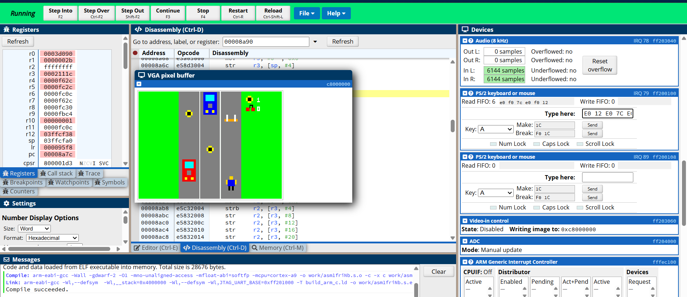

# Subway Surfers (DE1-SoC / CPULator)

A compact Subway Surfers–style runner built for the DE1-SoC memory map, designed to run in CPULator with VGA output and a PS/2 keyboard.

## Screenshot

## Features
- 3-lane endless runner with trains, hurdles, coins, and bonus cherries
- Jumping, lane switching, pause, and replay
- Simple audio beeps for feedback
- High score shown on HEX displays

## Controls (PS/2)
- Left Arrow: move left
- Right Arrow: move right
- Up Arrow: jump
- Spacebar: start / pause / resume / replay

## Run In CPULator (DE1-SoC)
[Link to CPULator](https://cpulator.01xz.net/?sys=arm-de1soc)
1. Open [CPULator](https://cpulator.01xz.net/).
2. Select **ARMv7 DE1-SoC** (or the DE1-SoC platform that includes VGA and PS/2).
3. Create a new project and paste the contents of `subway_surfers.c`, or upload the file.
4. Compile and Load after switching to C and continue .

Notes:
- The game writes directly to the VGA pixel buffer and expects 320x240 RGB565.
- PS/2 scan codes are read from the PS/2 controller register.
- If you use a different platform, update the memory-mapped addresses at the top of the file.

